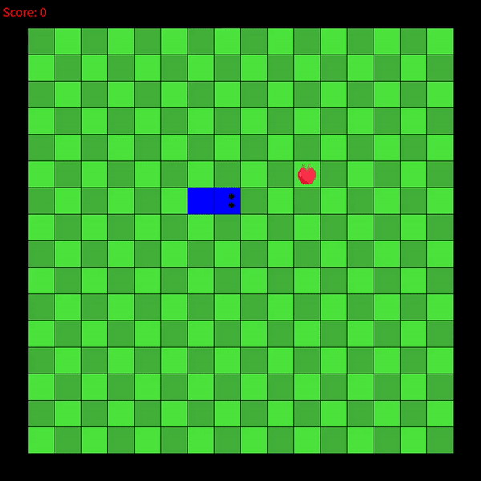
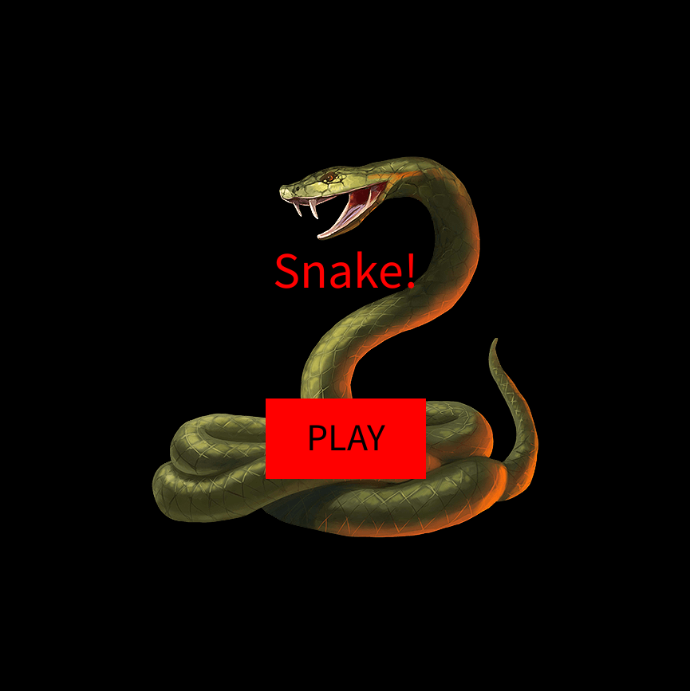
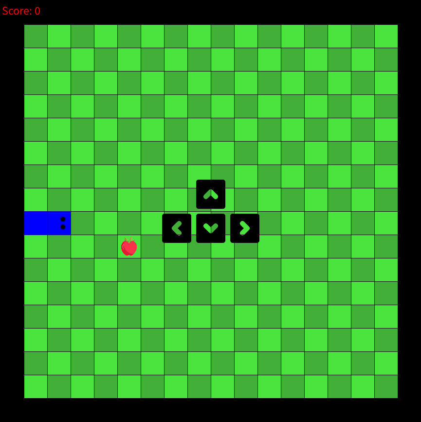
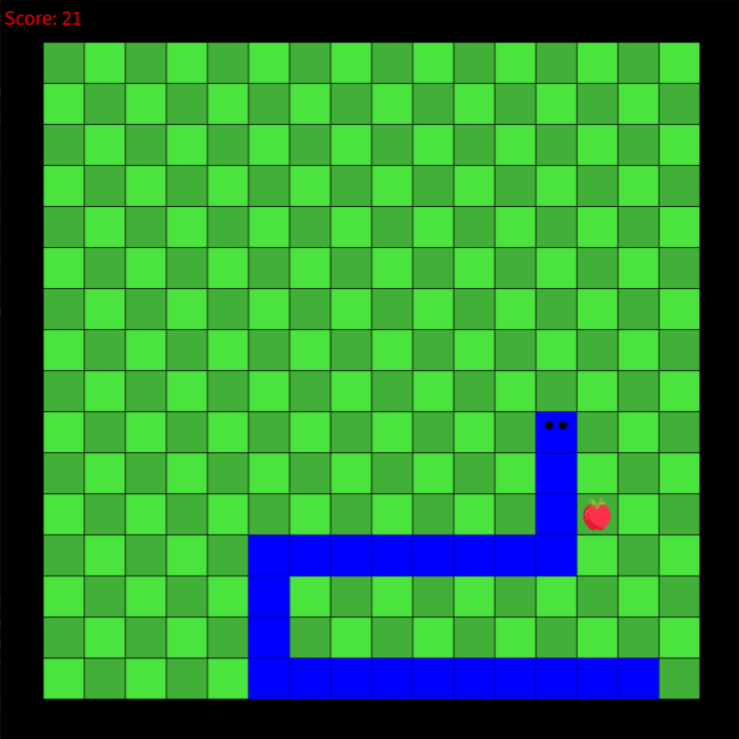
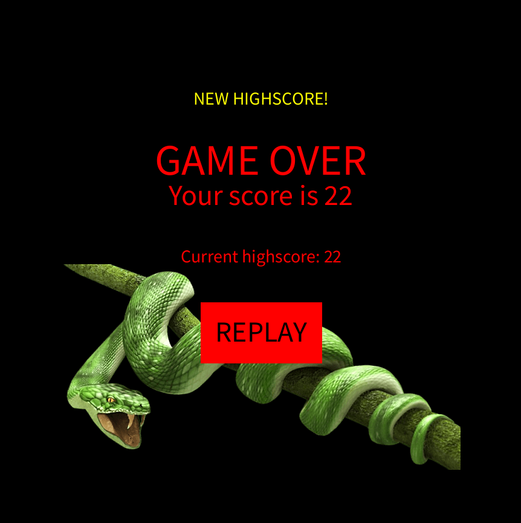

# Snake 
---

This is a remake of the popular computer game snake. The objective of the game is to attain the highest score possible by eating apples. The more you eat, the bigger the snake grows, which in turn becomes an obstacle to yourself.

This program was written using the Java library Processing. The snake.pde file executes the game.

---

Upon execution of the snake.pde file, the user will be presented with a start page.

After clicking the "PLAY" button or pressing enter, the user will be brought to the game page. The game will not begin until one of the direction keys is pressed.

Once the game starts, the user controls the snake by pressing the direction keys. Guiding the head of the snake to the apple will earn the user a point, which is displayed at the top left corner of the screen. The apple is repositioned at a random spot on the board. The game ends by either the head of the snake hitting the edge of the game board, or the head of the snake hitting part of the snake body.

After the game is over, the user is brought to the game over page that will display the score of the previous game and the session highscore. If the highscore is set during the previous game, the user is notified. Clicking the "REPLAY" button or pressing enter will restart the game.

