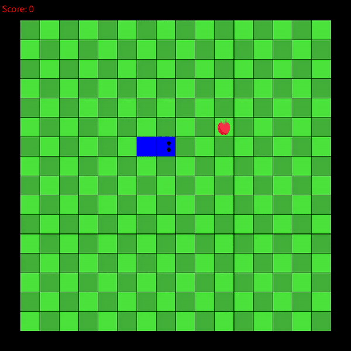

# Snake 
---

This is a remake of the popular computer game snake. The objective of the game is to attain the highest score possible by eating apples. The more you eat, the bigger the snake grows, which in turn becomes an obstacle to yourself.

This program was written using the Java library Processing. The snake.pde file executes the game.

